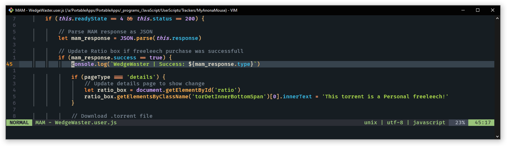

  <h1>🐵 UserScripts 🐵</h1>
  

A WirlyWirly collection of [UserScripts](https://openuserjs.org/about/Userscript-Beginners-HOWTO), new and old, for an assortment of sites

All UserScripts are written in [NeoVim](https://neovim.io/) and tested on [LibreWolf](https://librewolf.net/) via [Violentmonkey](https://violentmonkey.github.io/)

